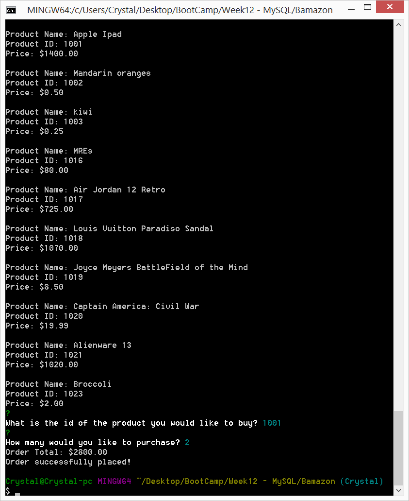
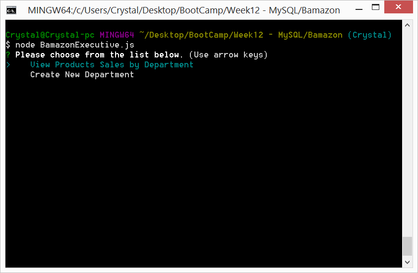
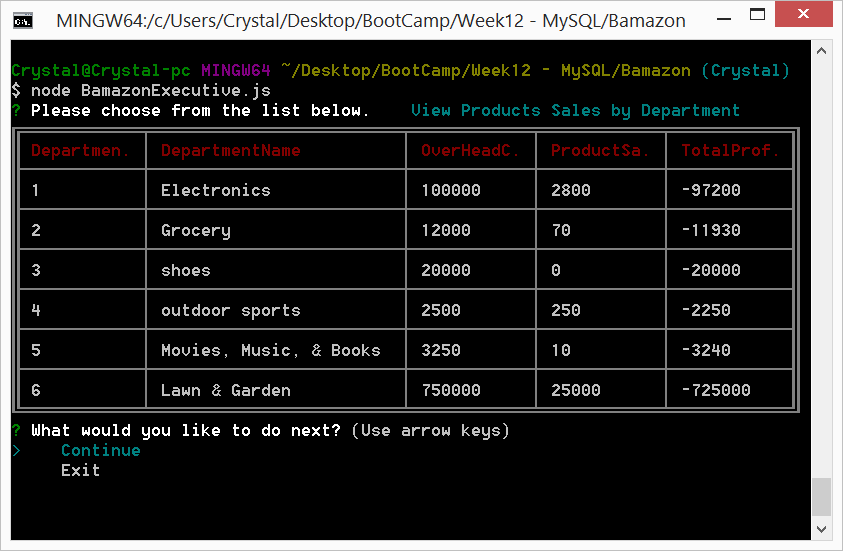
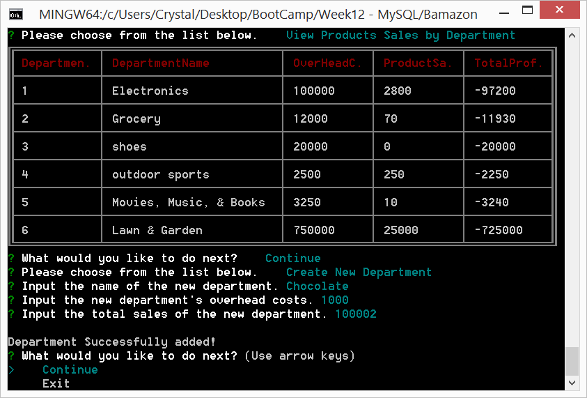

# Bamazon

BamazonCustomer.js - View All Products

 

BamazonCustomer.js - Customer Purchase

 

BamazonManager.js - View Products For Sale

 

BamazonManager.js - View Products For Sale (2)

 

BamazonManager.js - View Low Inventory

 

BamazonManager.js - Add to Inventory

 

BamazonManager.js - Add to Inventory (2)

 

BamazonManager.js - Add New Product

 

BamazonExecutive.js - Prompt User

 

BamazonExecutive.js - Display Departments

 

BamazonExecutive.js - Add New Department

 
